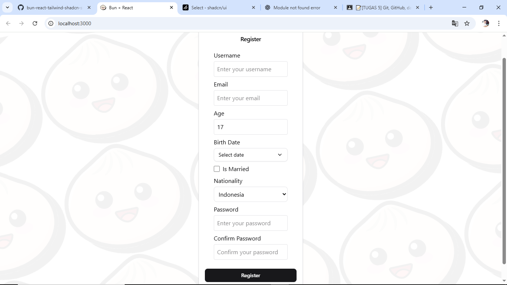

# 🧾 Form Registrasi - Tugas 8

Form ini merupakan bagian dari project React TypeScript dengan fitur **registrasi pengguna** yang meliputi beberapa input field seperti nama, email, usia, tanggal lahir, dan kewarganegaraan.

---

## ✨ Fitur yang Dibuat

- Input field untuk:
  - Username
  - Email
  - Usia (Age)
  - Tanggal Lahir (Birth Date) – menggunakan komponen `BirthDate` custom.
  - Status Pernikahan (Is Married)
  - Kewarganegaraan (Nationality) – menggunakan `enum` dari `@/enums`.

- Validasi menggunakan library `@tanstack/react-form`.
- Komponen form modular yang mudah dikembangkan.
- Responsif dan siap untuk integrasi API.
- Notifikasi hasil submit menggunakan `sonner`.

---

## 📸 Screenshot



> Gambar di atas menunjukkan tampilan form register lengkap dengan input yang telah diformat rapi dan responsif.

---

## 🗂️ Struktur File Terkait
```
src/
└── components/
└── ui/
└── shared/
└── form/
├── RegisterForm.tsx # Komponen utama form register
├── BirthDate.tsx # Komponen tanggal lahir
└── ...
└── enums/
└── nationality.enum.tsx # Enum Nationality
└── interfaces/
└── form-register.interface.tsx # Tipe data untuk nilai form
```